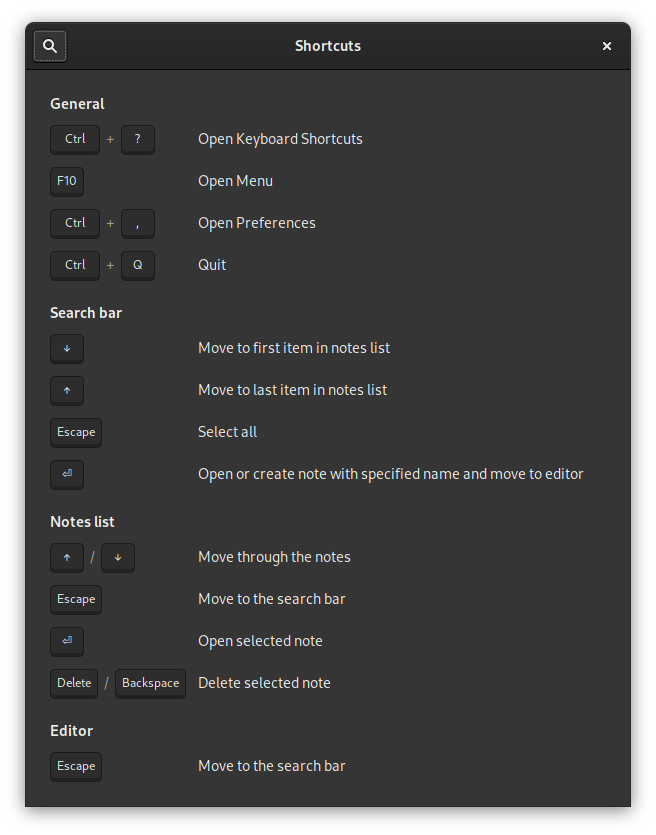
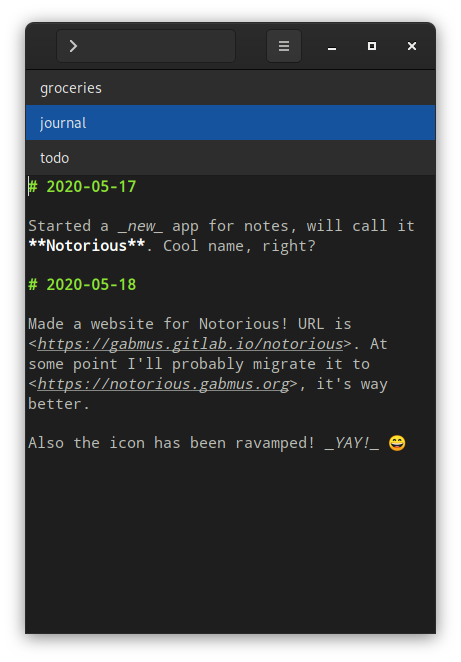
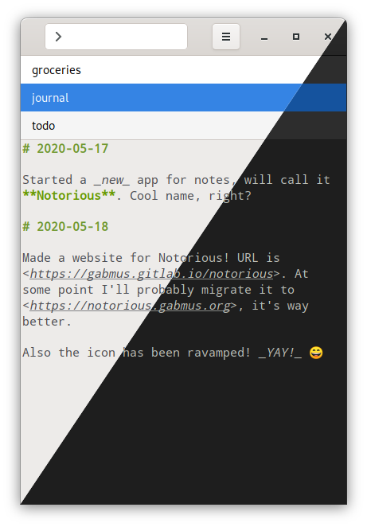

<nav>

- [ **Notorious**](#)
- [Features](#features)
- [Install](#install)
- [Hack](#hack)
- [Support](#support)

</nav>

<!--@MARGIN@-->

# Notorious

## Keyboard centric notes

---

## Features

### Made for power users

Notorious can be controlled entirely with your keyboard. No need to move your hand to the mouse, just open it up and dump your brain.

### Markdown powered (if you want to)

Many like to use Markdown to write their notes. Hack I even use it on paper nowadays. In Notorious you can write your notes however you want, but if you like Markdown, you can easily enable syntax highlighting.

### Dark mode

I love dark mode. Who doesn't?

### Autosave

No need to worry about saving. When you change note or exit the app whatever you wrote gets automatically saved.

### No sync

No need for cumbersome online sync features. Just choose a folder on your disk and that's it. Of course nothing stops you froms syncing that folder with your service of choice. Complete freedom!

---

## Install

### Flatpak (recommended)

[Install **Flatpak** by following the quick setup guide](https://flatpak.org/setup/). Does it work on your distribution? Most likely.

Then, click the button below to install Notorious:

<!-- ### Fedora

Notorious is available on Fedora's official repos. Just run `sudo dnf install notorious` in your terminal to install it. Alternatively, use [Flatpak](#flatpak-recommended) to get the latest and greatest version of Notorious. -->

### AUR

If you're using Arch Linux or an Arch based system, you can install the [`notorious-git`](https://aur.archlinux.org/packages/notorious-git/) package from the AUR.

---

## Hack

Notorious is written using Python 3 and GTK+ 3. It's free software, released under the GPL3 license. Feel free to browse the source code on [the GitLab repository](https://gitlab.gnome.org/GabMus/notorious), fork it, make changes or open issues!

---

## Support

Have you found a bug? Do you want a new feature? Whatever the case, opening an issue is never a bad idea. You can do that on [the issue page of Notorious' GitLab repository](https://gitlab.gnome.org/GabMus/notorious/issues)
